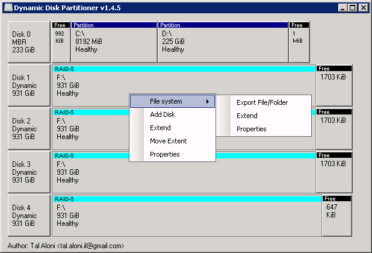

Dynamic Disk Partitioner:
==========================
Dynamic Disk Partitioner is a volume manager (a.k.a. partition manager) targeted at Windows Dynamic disks.  

##### Q: What this program can do?  
1. Add disk to a RAID-5 volume.  
2. Extend partitions / dynamic volumes.  
3. Extend NTFS volumes.  
4. Initialize a GPT disk with an aligned data portion (i.e. 4KB alignment for Advanced Format 512e drives) and set the size of the Microsoft Reserved partition.  
5. Move dynamic disk extent to a different position on the disk.  
6. Move dynamic disk extent to another disk.  
7. Create degraded RAID-5 volumes.  
8. Copy files from dynamic volumes even without operating system support for such volumes*.  

The program was designed to withstand a power failure, and can resume the 'move' and 'add disk' operations after a power failure without data loss.  

*for example, you can connect disks with RAID-5 volume to a computer running Windows XP (which does not support RAID-5 volumes), and copy files from the volume using this program.  

##### Supported operating systems:  
Windows 2000 / Windows XP / Server 2003 / Windows Vista / Windows 7 / Server 2008  

Note 1: Windows Vista introduced direct disk access limitations, but a disk can still be directly accessed when taken offline.  

Note 2: The on-disk data-structures are identical from Windows 2000 to Windows Server 2016.  

Note 3: In some cases Windows Vista will detect some disks as 'foreign' after taking the disks back online, import the disks and refresh the view (F5) to bring the array back to health.  

##### Warnings:  
1. The software may contain bugs and/or limitations that may result in data loss, backup your critical data before using it.  
I take no responsibility for any data loss that may occur.  

2. There are no official specifications for the LDM database.  
the structure has been reverse engineered ( https://flatcap.github.io/linux-ntfs/ldm/ ) and while I believe most of the information is accurate, there are some unknowns.  

3. There are no official specifications for the NTFS file system.  

##### Note about the difference between volume size and file system size:  
Whenever you use the 'extend volume' or 'add disk' operations in Dynamic Disk Partitioner, you are extending the volume, the filesystem remains unchanged.  
To extend the filesystem (to include the newly unallocated space at the end of the volume after extending the volume / adding disk) use the 'extend filesystem' operation.  

##### Notes about adding disk to a RAID-5 array:  
In Striped / RAID-5 Volumes, data is written in stripes across disks, like this:  
Disk 0:	00	03	06	09  
Disk 1:	01	04	07	10  
Disk 2:	02	05	08	11  

So a volume with added disk should look like this:  
Disk 0:	00	04	08  
Disk 1:	01	05	09  
Disk 2:	02	06	10  
Disk 3:	03	07	11  

This means that every stripe on every disk will have to be read and overwritten,  
To avoid data loss, Dynamic Disk Partitioner only performs this operation on RAID-5 volumes, The operation is performed in a way that allows the data to be restored even if a disk fails during the operation.  

Contact:
========
If you have any question, feel free to contact me.  
Tal Aloni <tal.aloni.il@gmail.com>
